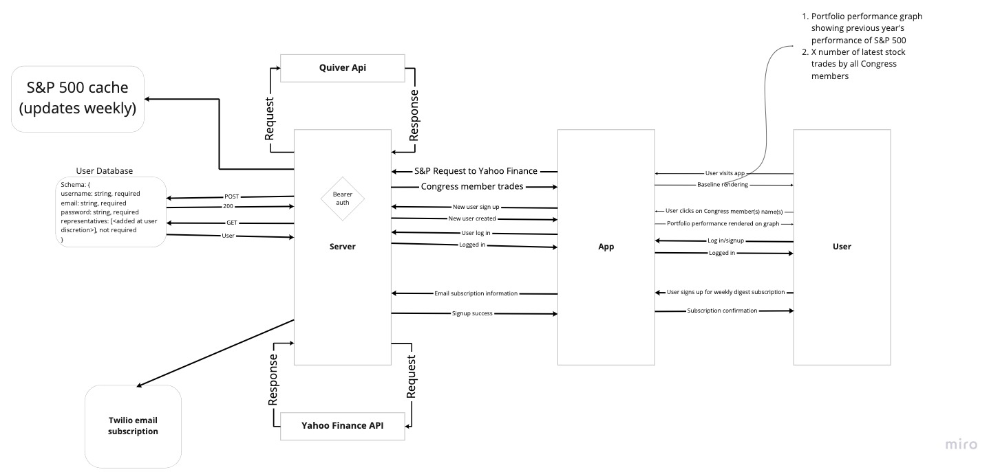

# Congress Stock Watch App

## Authors

- [Abdinasir Yussuf](https://github.com/abditake)
- [Beau Hibbert](https://github.com/BeauHibbert)
- [Brady Davenport](https://github.com/bradydavenport)
- [Cody Davis](https://github.com/Cozhee)

### About

As of late, it appears some members of Congress are seeing stellar performance in their stock portfolios - or least the awareness of such is increasing.  While there is a lot of conjecture on the source of many Congressmembers' gains, this app simply displays the stock trading activity and portfolio performance of Congress members - something that is already publicly available information (See [House members trading](https://disclosures-clerk.house.gov/PublicDisclosure/FinancialDisclosure), [Senate trading](https://www.senate.gov/legislative/lobbyingdisc.htm#lobbyingdisc=lda)).

*Disclaimer*: this app exists purely for informational purposes.  Neither this app nor its authors make any inference to the intent behind any Congress member's stock trading activity. Further, nothing provided by this app should be interpreted as financial advice, as it is not.  

### Links

- [GitHub Organization](https://github.com/CongressStockWatch)
- [Team Trello Organization](https://trello.com/401finalproject2)
- [Team Agreement](team-agreement.md)

### Domain Model & Wireframe

### References and Credit

- [Quiver Quantitative](https://www.quiverquant.com/)
- [Quiver Quantitative API](https://api.quiverquant.com/)
- [Yahoo Finance API](https://www.npmjs.com/package/yahoo-finance)
